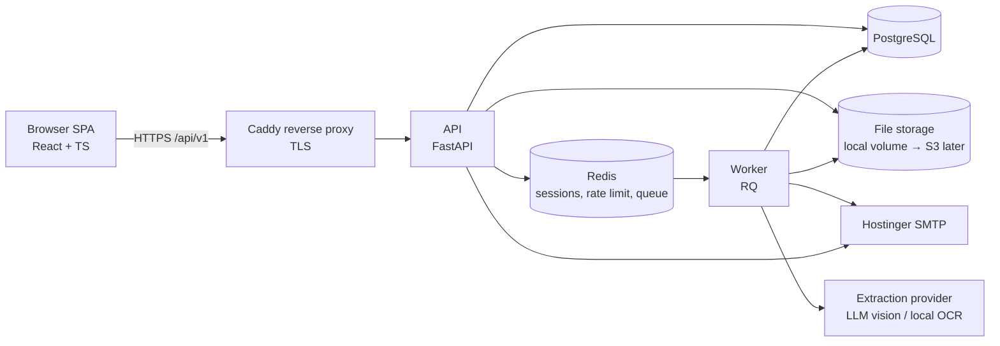
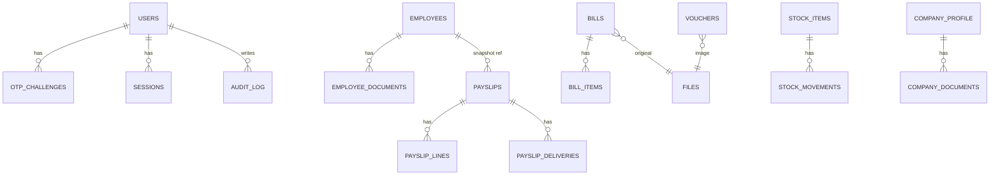

# SANGAD — Architecture & Build Plan

**Product:** Customized Admin Management Dashboard (micro-SaaS)
**Version:** 0.1 · **Date:** 2026-10-01 · **Status:** Draft for approval
**Sources:** `sangee.docx` (admin plan + 2 UI references), `Payslip_Template_LLP.docx` (Blude TechX LLP payslip)

---

## 0. How to use this document

Doc order = build order. Constraints gate everything.

| # | Section | Purpose |
|---|---|---|
| 1 | Constraints | Hard limits and assumptions |
| 2 | PRD | What to build (`F-` ids) |
| 3 | Architecture | How it is structured (`D-` ids) |
| 4 | Design | UI system and screens |
| 5 | Rules | Coding rules for humans and AI agents (`R-` ids) |
| 6 | Tasks | Phased plan (`T-` ids) |
| 7 | Validation | Acceptance checks (`V-` ids) |
| 8 | ADRs | Decisions and trade-offs (`ADR-` ids) |
| 9 | Open questions | Gaps found in the source docs |

**Cross-reference scheme:** `F-` requirement · `D-` design · `R-` rule · `T-` task · `V-` validation · `ADR-` decision.
A task is done only when its linked `V-` ids pass.

**AI-agent protocol (applies to every coding session):**
1. Read sections 1, 3, 5 first, then the one module section being built.
2. One module per session. Never edit another module's tables or internals.
3. Every commit message cites a `T-` id.
4. Do not invent requirements. Unknowns go to section 9.

---

## 1. Constraints & assumptions

| Id | Constraint |
|---|---|
| C-01 | Exactly **one master user**. No sign-up, no multi-user UI in v1. Schema supports roles for later. |
| C-02 | Landing page shows exactly **five modules**: Payslip, Bills, Inventory, Employees, Company. |
| C-03 | OTP and payslip emails go through the **Hostinger mailbox** (SMTP). Verify host, port and hourly send limits in the Hostinger panel. |
| C-04 | Currency ₹ INR. Financial year Apr–Mar (current: FY 2026-27). Amounts in words use Indian numbering (lakh, crore). |
| C-05 | PII held: Aadhaar, DoB, address, blood group, salary, contact. Treat under India's DPDP Act 2023: encrypt, mask, audit, restrict. Get legal review before go-live. |
| C-06 | Micro-SaaS cost profile: single VPS, Docker Compose, no Kubernetes. |
| C-07 | Payslip output must match the uploaded Blude TechX LLP template. |
| C-08 | Delivery order: **Architecture → Modules 1-5 built standalone → Integration**. |

**Assumptions (change in section 9 if wrong):**
- A-01 Hosting on a Hostinger VPS (Linux, Docker).
- A-02 Python backend (matches existing team skills: pandas, openpyxl, smtplib).
- A-03 Browser-based, responsive; camera capture works on mobile browsers.
- A-04 Cloud AI is acceptable for bill extraction (with human review). If not, use the local OCR fallback only (ADR-06).

---

## 2. PRD — functional requirements

### 2.1 Auth & shell (shared)

| Id | Requirement |
|---|---|
| F-AUTH-01 | Login with **name + password**, then **email OTP** to the configured Hostinger address. |
| F-AUTH-02 | OTP: 6 digits, 5-minute expiry, single use, max 5 attempts, 60 s resend cooldown. |
| F-AUTH-03 | **Password change requires OTP** verification by email. |
| F-AUTH-04 | Top-right of every page shows **username and role** (role = `master`). |
| F-AUTH-05 | Login lockout after repeated failures; logout; idle session timeout. |
| F-LAND-01 | Landing page shows five module cards only. |

### 2.2 Module 1 — Payslip

| Id | Requirement |
|---|---|
| F-PAY-01 | Data entry by **upload** `.xlsx` / `.csv` (downloadable import template provided). |
| F-PAY-02 | Data entry by **manual form**. |
| F-PAY-03 | Import validates every row; shows row-level errors; nothing is saved until errors are fixed or rows are skipped. |
| F-PAY-04 | After submit, show **preview in payslip format** (matches template). |
| F-PAY-05 | From preview, **edit via form**, re-preview. |
| F-PAY-06 | **Download** payslip (PDF; DOCX optional). |
| F-PAY-07 | **Email** payslip to the employee's address (single and bulk). Track sent / failed; retry failures. |
| F-PAY-08 | Payroll list screen: KPI cards (Total Payroll, Paid Employees, Pending, Avg Salary), search, filter, month picker, list/grid toggle, status badge, View Payslip action. |
| F-PAY-09 | Calculations: `Gross = Basic + Other Allowances`; `Net = Gross − Total Deductions`; Net in words (Indian numbering). |
| F-PAY-10 | Template fields: Employee Name, Employee ID, Designation, Date of Joining, Aadhaar No., Pay Period, Date of Issue, Bank Payment Mode, Total Working Days, Days Paid, Earnings, Net Pay, Net Pay in Words. |
| F-PAY-11 | Letterhead (address, phone, email, website) and signatory name come from company data, not hard-coded. |
| F-PAY-12 | PF note printed only when company setting `pf_applicable = false`. |
| F-PAY-13 | One payslip per employee per month. Lifecycle: `Draft → Generated → Sent`. Edits after `Sent` create a new revision; old revision is kept. |
| F-PAY-14 | Aadhaar on payslip is masked by default (`XXXX XXXX 1234`); full number is a setting. |

### 2.3 Module 2 — Bills

| Id | Requirement |
|---|---|
| F-BILL-01 | Entry by upload (image, PDF, Word), manual form, or **camera**. |
| F-BILL-02 | **Auto-extract** date, vendor name, product(s), price from the document. |
| F-BILL-03 | Extraction result lands in a **review** screen; user confirms before commit. |
| F-BILL-04 | Confirmed bills are written to the database and exportable to **Excel / CSV**. |
| F-BILL-05 | Every bill/invoice gets a unique serial: `BILL-<FY>-<6 digits>`, e.g. `BILL-2627-000001`. |
| F-BILL-06 | Cash **vouchers** (below a configurable threshold, default ₹2,000) get a separate serial: `VCH-<FY>-<6 digits>`. Image upload supported. |
| F-BILL-07 | **Expense calculation** across bills + vouchers: totals by period, category, vendor. |
| F-BILL-08 | Expenses screen (per UI reference 2): KPI cards, monthly trend chart (6 months), by-category breakdown, filterable table (All / Paid / Pending / Overdue / Draft), search, export. |
| F-BILL-09 | Duplicate warning (same file hash, or same vendor + date + amount). |
| F-BILL-10 | Original file is always retained and linked to the record. |

### 2.4 Module 3 — Inventory (called "Stocks" in the plan)

| Id | Requirement |
|---|---|
| F-INV-01 | Manual entry only: add, edit, manage stock items via forms. |
| F-INV-02 | Item fields: SKU, name, category, unit, quantity, reorder level, unit cost (extend as needed). |
| F-INV-03 | Stock changes are recorded as **movements** (in / out / adjustment); quantity on hand derives from the ledger. |
| F-INV-04 | Low-stock flag when quantity ≤ reorder level. |
| F-INV-05 | List with search, filter, export. |

### 2.5 Module 4 — Employees

| Id | Requirement |
|---|---|
| F-EMP-01 | Manual entry via form, plus upload of original documents (image, PDF, Word). |
| F-EMP-02 | Fields: Name, DoB, Address, Salary, Employee ID, Contact No., Office No., Designation, Office Address, Aadhaar No., Email, Blood Group. |
| F-EMP-03 | **Added (gap):** Date of Joining, Bank Payment Mode (required by payslip). |
| F-EMP-04 | Aadhaar validated (12 digits, Verhoeff checksum), stored encrypted, masked in UI, full view requires an explicit "reveal" action that is audited. |
| F-EMP-05 | Employee ID unique. Soft-delete only (payslip history must survive). |
| F-EMP-06 | Search, filter, export. |

### 2.6 Module 5 — Company details

| Id | Requirement |
|---|---|
| F-CMP-01 | Manual entry via form, plus upload of original documents (image, PDF, Word). |
| F-CMP-02 | Fields: Legal name, GST No., Incorporation number, registered address, phone, email, website. Suggested: PAN, TAN, authorised signatory name. |
| F-CMP-03 | GSTIN validated by format and checksum. |
| F-CMP-04 | Single company profile record; edits are audited. |
| F-CMP-05 | Feeds payslip letterhead and signatory block (F-PAY-11). |

---

## 3. Architecture

### 3.1 Style — modular monolith (ADR-01)

One backend deployable, one SPA, one Postgres, one Redis, one worker. Five business modules plus a shared kernel. Modules talk through **ports** (interfaces), never through each other's tables.



### 3.2 Technology stack

| Layer | Choice | Why |
|---|---|---|
| Frontend | React 18, TypeScript, Vite, Tailwind, shadcn/ui | Fast, typed, matches both UI references |
| Frontend data | TanStack Query + TanStack Table, React Hook Form + Zod, Recharts | Server-state, tables, forms, charts |
| API client | `openapi-typescript` generated from backend OpenAPI | Contract drift is a build error |
| Backend | Python 3.12, FastAPI, Pydantic v2 | Existing Python skills; auto OpenAPI |
| ORM / DB | SQLAlchemy 2.0, Alembic, PostgreSQL 16 | Relational integrity, migrations |
| Queue | Redis + RQ | Sync-friendly for pandas, openpyxl, WeasyPrint |
| PDF | Jinja2 HTML + WeasyPrint (ADR-03) | One template for preview and PDF |
| Office files | openpyxl, pandas, python-docx / docxtpl | Import/export |
| Money | `decimal.Decimal` + `NUMERIC(14,2)` | Never float (R-05) |
| Hashing | argon2-cffi (Argon2id) | Password hashing |
| Crypto | AES-GCM (`cryptography`), key from env | Field-level encryption for Aadhaar |
| Infra | Docker Compose: caddy, api, worker, postgres, redis | C-06 |
| CI | GitHub Actions: ruff, mypy, pytest, eslint, tsc, vitest, Playwright | Quality gates |

### 3.3 Repository layout

```
sangad/
├─ docs/                      # this file + ADRs
├─ backend/
│  ├─ app/
│  │  ├─ main.py
│  │  ├─ core/                # config, db, security, errors, logging
│  │  ├─ kernel/              # shared: auth, audit, files, mail, jobs,
│  │  │                       #   sequences, money, pdf, ports
│  │  └─ modules/
│  │     ├─ payslip/          # router, service, repo, models, schemas, templates, tests
│  │     ├─ bills/
│  │     ├─ inventory/
│  │     ├─ employees/
│  │     └─ company/
│  ├─ migrations/             # Alembic, one branch label per module
│  └─ tests/
├─ frontend/
│  └─ src/
│     ├─ app/                 # router, providers, shell
│     ├─ shared/              # ui kit, api client, hooks, utils
│     └─ features/{auth,landing,payslip,bills,inventory,employees,company}/
└─ infra/                     # compose, Caddyfile, backup scripts, env examples
```

### 3.4 Module boundaries and integration seams (D-ARCH-01)

Each module is built **standalone** with stub adapters, then integration swaps stubs for real adapters. No module rewrites are needed at integration (ADR-02).

| Module | Owns tables | Exposes | Consumes (ports) | Standalone stub |
|---|---|---|---|---|
| Payslip | `payslips`, `payslip_lines`, `payslip_deliveries`, `import_jobs` | `PayslipService` | `EmployeeDirectoryPort`, `CompanyProfilePort`, `MailPort`, `PdfPort`, `FileStoragePort` | Employee data comes from the upload row / form; company data from a config file |
| Bills | `bills`, `bill_items`, `vouchers`, `extraction_jobs` | `ExpenseSummaryService` | `ExtractionPort`, `SequencePort`, `FileStoragePort` | none needed |
| Inventory | `stock_items`, `stock_movements` | `InventoryService` | none | none |
| Employees | `employees`, `employee_documents` | implements `EmployeeDirectoryPort` | `FileStoragePort` | none |
| Company | `company_profile`, `company_documents` | implements `CompanyProfilePort` | `FileStoragePort` | none |
| Kernel | `users`, `otp_challenges`, `sessions`, `audit_log`, `files`, `number_sequences` | auth, audit, files, mail, jobs, sequences | — | — |

Integration points (Phase 3):
1. Payslip ← Employees: employee picker replaces manual employee fields.
2. Payslip ← Company: letterhead, signatory, `pf_applicable`.
3. Dashboard ← Bills, Inventory, Employees: summary counts on landing cards.

**Payslips store a snapshot** of employee and company fields at issue time. Integration only adds a nullable `employee_ref`. A reissued employee record never rewrites history.

### 3.5 Data model (D-DATA-01)



Key tables (columns abbreviated):

| Table | Key columns / rules |
|---|---|
| `users` | id, username (unique), password_hash, role, email, is_active |
| `otp_challenges` | id, user_id, purpose (`login`/`password_change`), code_hash, expires_at, attempts, consumed_at |
| `employees` | id, employee_code (unique), name, dob, address, salary, contact_no, office_no, designation, office_address, aadhaar_enc, aadhaar_last4, email, blood_group, date_of_joining, payment_mode, deleted_at |
| `payslips` | id, month (`YYYY-MM`), revision, status, snapshot JSONB (employee + company), total_working_days, days_paid, gross, total_deductions, net, net_in_words, issued_on, employee_ref (nullable). Unique (employee key, month, revision) |
| `payslip_lines` | payslip_id, kind (`earning`/`deduction`), label, amount |
| `payslip_deliveries` | payslip_id, to_email, status, attempts, last_error, sent_at |
| `bills` | id, serial (unique), vendor, bill_date, total, category, status, file_id, source (`upload`/`manual`/`camera`), extraction_confidence, reviewed_at |
| `bill_items` | bill_id, description, qty, unit_price, amount |
| `vouchers` | id, serial (unique), voucher_date, payee, amount, category, file_id |
| `number_sequences` | (series, fy) primary key, last_value. Incremented with `SELECT … FOR UPDATE` in the same transaction as the insert, so numbers are gapless |
| `stock_items` | id, sku (unique), name, category, unit, reorder_level, unit_cost |
| `stock_movements` | id, item_id, kind, qty, reason, created_at. Quantity on hand = sum of movements |
| `company_profile` | single row: legal_name, gstin, incorporation_no, address, phone, email, website, signatory, pf_applicable |
| `files` | id, sha256, mime, size, storage_key, uploaded_by, created_at |
| `audit_log` | id, actor, action, entity, entity_id, at, ip, meta JSONB |

All tables: `id` UUID, `created_at`, `updated_at`. Add nullable `tenant_id` only if multi-tenant is approved (section 9).

### 3.6 API conventions (D-API-01)

- REST under `/api/v1/<module>/…`; OpenAPI is the contract.
- Errors: RFC 7807 `application/problem+json` with stable `code`.
- Lists: cursor or page + size, `q` search, explicit `sort`, filters as query params.
- Mutating email/send endpoints take an `Idempotency-Key` header.
- Long work (import, extraction, bulk email, PDF batch) returns `202` + `job_id`; poll `/jobs/{id}`.
- Money serialised as strings (`"12345.50"`), never JSON floats.

### 3.7 Security (D-SEC-01)

| Area | Control |
|---|---|
| Passwords | Argon2id; minimum length policy; no hints |
| OTP | Stored hashed; expiry, attempt cap, resend cooldown; rate limit by IP and user |
| Session | Opaque server-side session in Redis; `HttpOnly`, `Secure`, `SameSite=Strict` cookie; CSRF token on mutations; idle timeout (ADR-04) |
| Transport | TLS only, HSTS |
| PII | Aadhaar encrypted at field level, masked by default, reveal audited; salary and DoB visible only inside authenticated views |
| Files | Private storage; served only through authenticated endpoint; size, MIME and magic-byte checks; filenames never trusted; optional AV scan (ClamAV) |
| Imports | Cap file size and row count; parse in worker; never evaluate formulas or macros |
| Audit | Log create/update/delete/export/send/reveal/login events |
| Secrets | Env or secret file, never in repo; rotation documented |
| Email | SPF, DKIM, DMARC set on the sending domain; throttle queue to Hostinger limits |
| Backups | Nightly `pg_dump` + file sync off-server; restore tested quarterly |

### 3.8 Payslip pipeline (D-PAY-01)

```
Upload/Form → validate (Pydantic) → Draft payslip (snapshot) →
Preview (HTML render) → [Edit form → re-render]* →
Generate PDF (WeasyPrint, worker) → store in files → Download
                                              └→ Email job → Hostinger SMTP → delivery status
```

- Single Jinja2 template drives both the on-screen preview and the PDF, so what is previewed is what is sent.
- `amount_to_words_inr()` is a pure function with unit tests (lakh/crore; paise handled).
- Import template columns: `employee_id, month, working_days, days_paid, basic, other_allowances, deductions (optional), payment_mode, date_of_issue (optional)`. In standalone mode the file also carries name, designation, date of joining, Aadhaar, email.
- Deductions are a list of lines (default empty → `Total Deductions = 0`).
- Optional later: password-protect emailed PDFs.

### 3.9 Bills extraction pipeline (D-BILL-01)

```
Upload/Camera → file stored (sha256, dedupe) → extraction job →
ExtractionPort.extract(file) → {date, vendor, items[], total, confidence} →
"Needs review" screen → user confirms/edits → commit + serial assigned →
Export to xlsx/csv · counted in expense summary
```

- `ExtractionPort` has two adapters: **LLM vision** (primary) and **local OCR** (Tesseract/PaddleOCR + rules, fallback). Switch by config (ADR-06).
- Extraction output is **never auto-committed**. Low-confidence fields are highlighted.
- Serial is assigned at **commit**, not upload, so rejected drafts leave no gaps.
- Word/PDF: convert to page images or text first, then extract. Camera: browser file-capture on mobile, with crop/rotate before upload.
- Voucher vs bill: chosen by the user at review (suggested by amount threshold).

### 3.10 Observability & operations

- Structured JSON logs with request id; no PII in logs.
- Health endpoints `/healthz`, `/readyz`; uptime check on the domain.
- Error tracking (Sentry or self-hosted equivalent).
- Job dashboard (RQ) behind auth.
- Deployment: `docker compose pull && up -d`; migrations run as a pre-start step; rollback = previous image tag + backup restore.

---

## 4. Design

### 4.1 App shell (D-UI-01)

- Layout: left sidebar (five modules + Settings), top bar, content area. Per the two UI references.
- Top bar right: **username + role** (F-AUTH-04), account menu (change password, logout).
- Landing page: five module cards in a grid. Each card: icon, title, one summary figure (after integration).
- Responsive: sidebar collapses on tablet/mobile; tables scroll inside their container.
- Visual language: neutral surfaces, one brand accent (green in reference 2), `₹` everywhere (references show `$` and `₦` as placeholders only).

### 4.2 Shared components (build once in Phase 0)

`AppShell`, `TopBar`, `ModuleCard`, `KpiCard`, `DataTable` (sort, filter, select, paginate), `FilterBar`, `SearchInput`, `StatusBadge`, `FileDropzone`, `CameraCapture`, `FormDrawer`, `ConfirmDialog`, `PdfPreview`, `MoneyText`, `EmptyState`, `Toast`, `OtpInput`.

### 4.3 Screens per module

| Module | Screens |
|---|---|
| Auth | Login → OTP → (Change password + OTP) |
| Payslip | Payroll list (reference 1) · Import wizard (upload → validate → fix → confirm) · Manual form · Preview + Edit · Send/Delivery status |
| Bills | Expenses dashboard (reference 2) · Add bill (upload / manual / camera) · Extraction review · Bill detail with original file · Vouchers list · Export |
| Inventory | Item list · Item form · Movement dialog · Low-stock filter |
| Employees | Employee list · Employee form · Documents tab · Aadhaar reveal dialog |
| Company | Single profile form · Documents tab |

### 4.4 UX rules

- Forms validate inline (Zod) and mirror server rules.
- Destructive actions confirm. Sends confirm recipient count.
- Every async action shows progress and a final result (job states: queued, running, done, failed).
- Accessibility: keyboard navigable, labelled inputs, contrast AA.

---

## 5. Rules

| Id | Rule |
|---|---|
| R-01 | Module code lives only in its own folder. Cross-module access goes through a **port** in `kernel/ports`. |
| R-02 | No module imports another module's models or repository. |
| R-03 | Routers are thin (validate, call service, return). Business logic lives in services. DB access lives in repositories. |
| R-04 | Every endpoint has Pydantic request/response models and an auth dependency. No unauthenticated routes except login, OTP, health. |
| R-05 | Money is `Decimal` / `NUMERIC(14,2)`, serialised as string. Never `float`. |
| R-06 | All dates stored UTC; business dates (`bill_date`, `issued_on`) stored as `DATE`. Display in IST. |
| R-07 | Schema changes only via Alembic migrations. One reviewed migration per change. |
| R-08 | PII never logged. Aadhaar never in URLs, logs, or error messages. |
| R-09 | File uploads: validate size, MIME, magic bytes; store by generated key; never use client filenames for paths. |
| R-10 | Anything slower than ~1 s (import, OCR, PDF batch, email) runs in the worker. |
| R-11 | Extraction output is advisory. Human review precedes commit. |
| R-12 | Serial numbers come only from `SequencePort` inside the insert transaction. |
| R-13 | Every create/update/delete/export/send/reveal writes an audit row. |
| R-14 | Frontend uses the generated API client only. No hand-written fetch to `/api`. |
| R-15 | Each module ships with unit tests, API tests, and one Playwright happy-path before it is "done". |
| R-16 | No new dependency without a one-line justification in the PR. |
| R-17 | Config via environment; `.env.example` kept current; no secrets in git. |
| R-18 | Lint, type-check, tests green in CI before merge. |

**AI-agent prompt header (paste at the start of each module session):**

```
You are implementing module <NAME> of SANGAD.
Read docs/SANGAD_ARCHITECTURE.md sections 1, 3, 5 and the <NAME> part of section 2.
Implement only task <T-ids>. Satisfy <V-ids>.
Respect rules R-01..R-18. Do not touch other modules. If a requirement is
missing or ambiguous, add it to section 9 instead of guessing.
Output: code, tests, migration, and a short summary of what changed.
```

---

## 6. Tasks

### Phase 0 — Architecture & platform skeleton

| Id | Task | Refs |
|---|---|---|
| T-000 | Approve this document; resolve blocking items in section 9 | all |
| T-001 | Monorepo, tooling, pre-commit, CI pipeline | R-16, R-18, V-PLAT-01 |
| T-002 | Docker Compose (caddy, api, worker, postgres, redis), env handling | C-06, R-17, V-PLAT-02 |
| T-003 | Backend core: config, DB session, Alembic, error model, logging | D-API-01, R-07 |
| T-004 | Kernel: auth (login, OTP, session, password change), mail adapter | F-AUTH-01..05, D-SEC-01, V-AUTH-01..06 |
| T-005 | Kernel: audit log, files service, sequences, job runner | R-09, R-12, R-13, V-PLAT-03 |
| T-006 | Frontend shell, design tokens, shared components, landing page | D-UI-01, F-LAND-01, V-UI-01 |
| T-007 | OpenAPI → typed client generation wired into build | R-14 |
| T-008 | Backups, health checks, deploy script | D-SEC-01, V-PLAT-04 |

Exit criteria: login with OTP works end to end on the VPS; landing shows five (empty) module cards; CI green.

### Phase 1 — Modules (each standalone, in your order)

**Module 1 — Payslip**

| Id | Task | Refs |
|---|---|---|
| T-101 | Models, migration, ports with stub adapters | D-DATA-01, D-ARCH-01 |
| T-102 | Calculations + `amount_to_words_inr` + unit tests | F-PAY-09, V-PAY-01 |
| T-103 | Manual form API + UI | F-PAY-02, F-PAY-10 |
| T-104 | Import template + upload validation + wizard | F-PAY-01, F-PAY-03, V-PAY-02 |
| T-105 | Jinja2 template replicating the Blude TechX layout; preview endpoint | F-PAY-04, F-PAY-11, F-PAY-12, V-PAY-03 |
| T-106 | Edit-and-repreview flow, revisions | F-PAY-05, F-PAY-13 |
| T-107 | PDF generation job + download | F-PAY-06, V-PAY-04 |
| T-108 | Email job, delivery tracking, retry, bulk send | F-PAY-07, V-PAY-05 |
| T-109 | Payroll list screen with KPIs | F-PAY-08 |

**Module 2 — Bills**

| Id | Task | Refs |
|---|---|---|
| T-201 | Models, migration, `SequencePort` usage | D-DATA-01, F-BILL-05, F-BILL-06 |
| T-202 | Upload (image/PDF/Word) + camera capture + dedupe | F-BILL-01, F-BILL-09, F-BILL-10 |
| T-203 | `ExtractionPort` + LLM adapter + local OCR adapter | F-BILL-02, D-BILL-01, V-BILL-01 |
| T-204 | Review screen, commit, serial assignment | F-BILL-03, F-BILL-05, V-BILL-02 |
| T-205 | Manual entry form, voucher flow | F-BILL-01, F-BILL-06 |
| T-206 | Excel/CSV export | F-BILL-04, V-BILL-04 |
| T-207 | Expense calculation + dashboard (KPIs, trend, categories, table) | F-BILL-07, F-BILL-08, V-BILL-03 |

**Module 3 — Inventory**

| Id | Task | Refs |
|---|---|---|
| T-301 | Models, migration, movement ledger | F-INV-02, F-INV-03 |
| T-302 | CRUD API + forms + list | F-INV-01, F-INV-05 |
| T-303 | Low-stock logic + export | F-INV-04, V-INV-01 |

**Module 4 — Employees**

| Id | Task | Refs |
|---|---|---|
| T-401 | Models, migration, field encryption for Aadhaar | F-EMP-02, F-EMP-04, V-EMP-01 |
| T-402 | CRUD API + form + list (soft delete) | F-EMP-01, F-EMP-05, F-EMP-06 |
| T-403 | Document upload tab | F-EMP-01 |
| T-404 | Implement `EmployeeDirectoryPort` | D-ARCH-01 |

**Module 5 — Company**

| Id | Task | Refs |
|---|---|---|
| T-501 | Model, migration, GSTIN validator | F-CMP-02, F-CMP-03, V-CMP-01 |
| T-502 | Profile form + documents tab | F-CMP-01, F-CMP-04 |
| T-503 | Implement `CompanyProfilePort` | F-CMP-05 |

Phase 1 exit criteria per module: its `V-` ids pass, R-15 satisfied, module demoable on its own.

### Phase 2 — Integration

| Id | Task | Refs |
|---|---|---|
| T-601 | Swap Payslip stubs for Employees + Company adapters (config flag) | D-ARCH-01, V-INT-01 |
| T-602 | Employee picker in payslip form; import by employee ID resolves from Employees | F-PAY-01, F-PAY-02 |
| T-603 | Letterhead and signatory from Company | F-PAY-11, V-INT-02 |
| T-604 | Landing cards show live summary figures | F-LAND-01 |
| T-605 | Cross-module audit review; end-to-end Playwright suite | R-13, V-INT-03 |

### Phase 3 — Hardening & release

| Id | Task | Refs |
|---|---|---|
| T-701 | Security pass: dependency audit, headers, rate limits, pen-test checklist | D-SEC-01, V-SEC-01 |
| T-702 | Performance pass on lists and PDF batch | V-PERF-01 |
| T-703 | Backup restore drill; runbook | V-PLAT-04 |
| T-704 | Legal/privacy review of PII handling (C-05) | C-05 |
| T-705 | UAT with real payslips and bills; go-live | all |

---

## 7. Validation

| Id | Check |
|---|---|
| V-PLAT-01 | CI runs lint, types, unit, API, e2e on every PR and blocks on failure. |
| V-PLAT-02 | `docker compose up` from a clean checkout yields a working stack. |
| V-PLAT-03 | Two concurrent inserts never produce a duplicate or skipped serial (load test, 100 parallel). |
| V-PLAT-04 | Restore from last night's backup into a fresh server succeeds. |
| V-AUTH-01 | Correct password alone does not create a session; OTP is required. |
| V-AUTH-02 | Expired, reused, or 6th-attempt OTP is rejected. |
| V-AUTH-03 | Password change fails without a valid OTP. |
| V-AUTH-04 | After N failed logins the account is locked for the configured window. |
| V-AUTH-05 | Top-right shows username and `master` on every page. |
| V-AUTH-06 | No API route except login/OTP/health responds without a valid session. |
| V-UI-01 | Landing shows exactly five modules. |
| V-PAY-01 | `123456.00` → "One Lakh Twenty-Three Thousand Four Hundred Fifty-Six Rupees Only"; paise and zero cases tested. |
| V-PAY-02 | Bad rows in an import are reported with row number and reason; valid rows can still be imported on request. |
| V-PAY-03 | Rendered payslip matches the template: all fields present, order and wording identical, ₹ symbol, signatory block. |
| V-PAY-04 | Downloaded PDF equals the preview; fonts embedded; renders on A4 without clipping. |
| V-PAY-05 | Email arrives with the PDF attached; failure is recorded and retryable; no duplicate send on retry with the same idempotency key. |
| V-BILL-01 | On a sample set of 30 real bills, date and total are correct for ≥ 90 %; vendor ≥ 85 %. Record the baseline per adapter. |
| V-BILL-02 | Serials are `BILL-<FY>-NNNNNN` and `VCH-<FY>-NNNNNN`, gapless per FY, reset on 1 April. |
| V-BILL-03 | Expense totals equal the sum of bills + vouchers for any date range (reconciled against export). |
| V-BILL-04 | Exported xlsx/csv opens cleanly in Excel; columns and totals match the screen. |
| V-INV-01 | Quantity on hand equals the sum of movements; low-stock flag flips at the threshold. |
| V-EMP-01 | Aadhaar is encrypted in the DB (raw dump shows no plaintext), masked in API list responses, reveal writes an audit row. |
| V-CMP-01 | Valid GSTINs pass; wrong checksum/format fails. |
| V-INT-01 | After integration, a payslip for an existing employee is created without retyping employee data. |
| V-INT-02 | Changing the company address changes new payslips only; old payslips are unchanged. |
| V-INT-03 | Full flow passes in Playwright: login+OTP → add employee → company set → payslip → preview → edit → PDF → email. |
| V-SEC-01 | Dependency audit clean of critical/high; security headers present; no PII in logs. |
| V-PERF-01 | List endpoints p95 < 500 ms at 10k rows; 50-payslip batch PDF completes < 2 min. |

---

## 8. Architecture decision records

| Id | Decision | Alternatives | Why |
|---|---|---|---|
| ADR-01 | Modular monolith | Microservices | One admin user, micro-SaaS cost; ports keep a later split possible |
| ADR-02 | Standalone modules behind ports with stub adapters | Build modules tightly coupled, wire later | Matches your "build 1-5 individually, then integrate" plan; integration becomes config |
| ADR-03 | Payslip via HTML template + WeasyPrint | docxtpl → LibreOffice → PDF | One template for preview and PDF; no LibreOffice in the runtime image. Trade-off: re-creating the Word layout in HTML. Optional DOCX export can use `docxtpl` on the original file later |
| ADR-04 | Server-side sessions in Redis | JWT access + refresh | Single user, instant revocation, no token handling in JS |
| ADR-05 | Payslip stores a snapshot, not live joins | Join live employee/company rows | Issued payslips are legal records and must not change |
| ADR-06 | Extraction behind `ExtractionPort`: LLM vision primary, local OCR fallback | Local OCR only | LLM vision handles varied invoices far better; port allows local-only if bills must not leave the server |
| ADR-07 | RQ (Redis) for jobs | Celery, arq | Simplest fit for synchronous pandas/openpyxl/WeasyPrint work |
| ADR-08 | Inventory as movement ledger | Editable quantity field | Auditable, supports correction history |
| ADR-09 | Serial at commit via locked sequence table | DB `SERIAL`, UUID | Gapless, per-FY reset, no gaps from rejected drafts |
| ADR-10 | Vite SPA | Next.js | Pure authenticated dashboard; no SEO or SSR need |

---

## 9. Open questions (found while reading the source docs)

Blocking before Phase 1 unless marked otherwise.

| # | Item | Impact | Proposed default |
|---|---|---|---|
| Q-01 | Payslip template shows **Earnings** and "Total Deductions" in the net-pay formula but **no deduction rows**. Which deductions exist (TDS, professional tax, LOP, advances)? | Payslip model | Free-form deduction lines; none by default |
| Q-02 | Is pay **prorated** by `Days Paid / Total Working Days`, or are amounts entered final? | F-PAY-09 | Entered final; optional proration toggle |
| Q-03 | Employee fields in the plan lack **Date of Joining** and **Bank Payment Mode**, both required by the payslip. | F-EMP-03 | Added (done in this doc) |
| Q-04 | Plan says vouchers "under 2000 or 100o". Is the threshold ₹2,000 or ₹1,000? | F-BILL-06 | Configurable, default ₹2,000 |
| Q-05 | Plan says "Stocks" in the body and "Inventory" on the landing page. Which label? | UI | "Inventory" |
| Q-06 | Show full Aadhaar on the payslip or masked? | F-PAY-14, C-05 | Masked |
| Q-07 | Can bill images go to a cloud AI provider? If not, local OCR only and lower accuracy. | ADR-06, V-BILL-01 | Cloud with review; switchable |
| Q-08 | Bill categories and statuses (Paid / Pending / Overdue / Draft in the reference). Fixed list or user-managed? | F-BILL-08 | Fixed starter list, editable later |
| Q-09 | Multi-tenant SaaS (several companies) now or later? Adds `tenant_id` everywhere. | C-01, data model | Single tenant now; do not paint into a corner |
| Q-10 | Overtime and Recurring columns appear in reference 1 but not in the payslip template. In scope? | F-PAY-08 | Out of v1 |
| Q-11 | Password-protect emailed payslip PDFs? If yes, with what secret? | F-PAY-07 | Off in v1 |
| Q-12 | Hostinger hourly/daily send limits vs. bulk payslip volume. | F-PAY-07 | Throttled queue; confirm limits |
| Q-13 | Domain / hostname for the app and sending domain (SPF/DKIM). | Deploy | Needed at T-002 |
| Q-14 | Is the OTP recipient fixed to the one mailbox in the plan, or stored per user? | F-AUTH-01 | Stored on the user record; configured at setup |

---

*End of document.*
